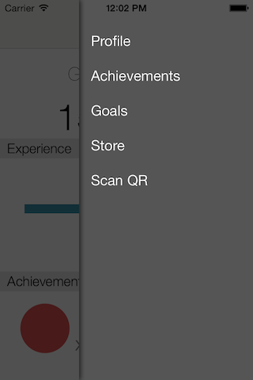
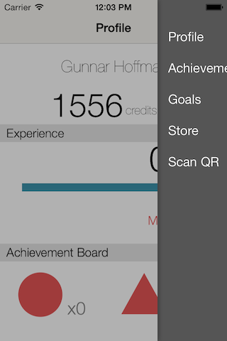

ios-sliding-menu
============

A simple right side slideout menu for iOS. This library subclasses UITabBarViewController and uses .viewControllers for all data and callbacks. Absolutely no code is required to make this work simply copy GSMViewController [.h](Slider/GSMViewController.h) and [.m](Slider/GSMViewController.m) into your project and read the instructions in the [.h](Slider/GSMViewController.h) file.

The GSMViewController has a slidingMenuDelegate and gives off notifications via the NSNotificationCenter. Both of these are described in the [GSMViewController.h](Slider/GSMViewController.h) file.

 

